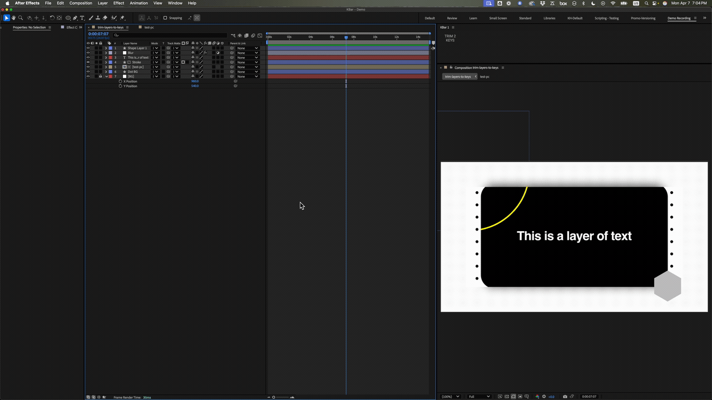

# Trim Layers To Keys

This After Effects script trims your layer in and out points based on the first and last keyframes on your layer. Simply select the layers you want to trim and run the script.

## Installation

The script must be placed in the Scripts directory in the
After Effects application folder. That folder will be named “Adobe After Effects [version]”
which has been replaced with “AE” below.

Mac OS X
```
/Applications/AE/Scripts
```

Windows
```
\Program Files\AE\Support Files\Scripts\
```

If After Effects was running when you installed the script, you’ll need to restart it.

Also, you’ll need to allow After Effects to write files.
To do that follow this path:
```
Preferences > General > Check-off “Allow Scripts to Write Files and Access Network” > Close
Preferences
```

## Steps

1. Select the layers or keyframes you want to trim in your composition.
2. Run the script from your favorite script launcher (e.g., Kbar) or launch it inside After Effects by navigating to:
   **File > Scripts > Run Script File**

## Script UI

This is a headless script (no panel).


